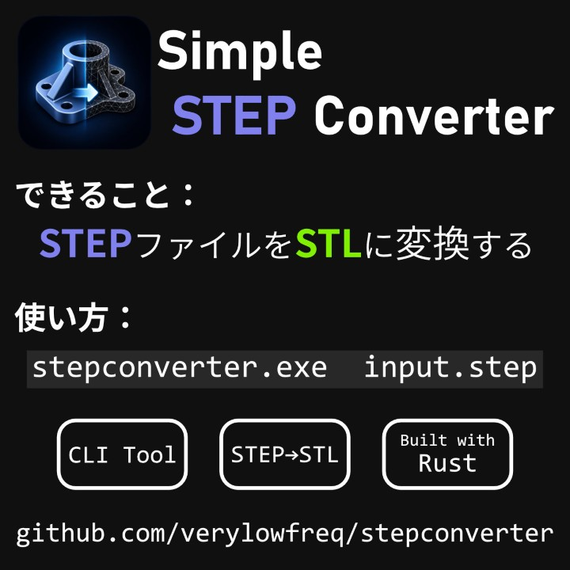

# Simple STEP Converter

Simple STEP Converterは、STEPファイルをSTLファイルへ変換するツールです。

Simple STEP Converter is a step-to-stl converter.




## 使い方 / Usage

デフォルト設定を利用して、STEPファイル ("INPUT.step") を INPUT.step.stl へ出力します。
この場合、トレランスは0.1、出力ファイルは存在すれば上書きされます。

```
stepconverter.exe INPUT.step
```

出力ファイル名の指定、トレランスの指定、上書きの許可をするには、以下のようにします。

```
stepconverter.exe INPUT.step OUTPUT.stl --tolerance 0.05 --allow-overwrite
```


## ライセンス / License

MIT License (c) 2026 Mitsumine Suzu (verylowfreq)

ライセンス全文は LICENSE ファイルを参照してください。Refer LICENSE file for full-text.


## 実装メモ

OpenCASCADEを、cadrum クレートを介して利用しています。

https://github.com/lzpel/cadrum
