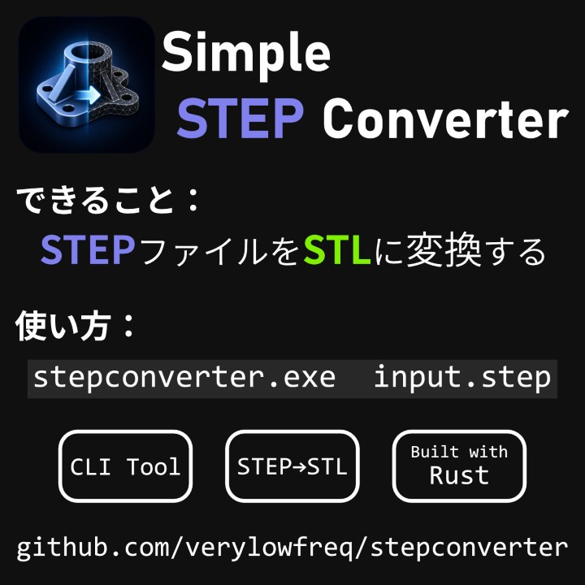

# Simple STEP Converter

Simple STEP Converterは、STEPファイルをSTL/GLBファイルへ変換するツールです。色情報も維持されます。

Simple STEP Converter is a step-to-stl/glb converter. Color information is preserved.




## 使い方 / Usage

デフォルト設定を利用して、STEPファイル ("INPUT.step") を INPUT.step.stl へ出力します。
この場合、トレランスは0.1、出力ファイルは存在すれば上書きされます。

```
stepconverter.exe INPUT.step
```

出力ファイル名の指定、トレランスの指定、上書きの許可をするには、以下のようにします。

```
stepconverter.exe INPUT.step OUTPUT.stl --tolerance 0.05 --allow_overwrite
```

出力形式（STL / GLB）は、出力ファイルの拡張子（`.stl` / `.glb`）から自動的に判定されます。
拡張子で判定できない場合や明示的に指定したい場合は `--format stl` または `--format glb` を指定してください。

```
stepconverter.exe INPUT.step OUTPUT.glb
stepconverter.exe INPUT.step OUTPUT.dat --format glb
```

The output format (STL / GLB) is automatically inferred from the output file's extension (`.stl` / `.glb`).
If the extension cannot be used to infer the format, or you want to specify it explicitly, use `--format stl` or `--format glb`.

```
stepconverter.exe INPUT.step OUTPUT.glb
stepconverter.exe INPUT.step OUTPUT.dat --format glb
```


## ライセンス / License

MIT License (c) 2026 Mitsumine Suzu (verylowfreq)

ライセンス全文は LICENSE ファイルを参照してください。Refer LICENSE file for full-text.


## 実装メモ

OpenCASCADEを、cadrum クレートを介して利用しています。

https://github.com/lzpel/cadrum
